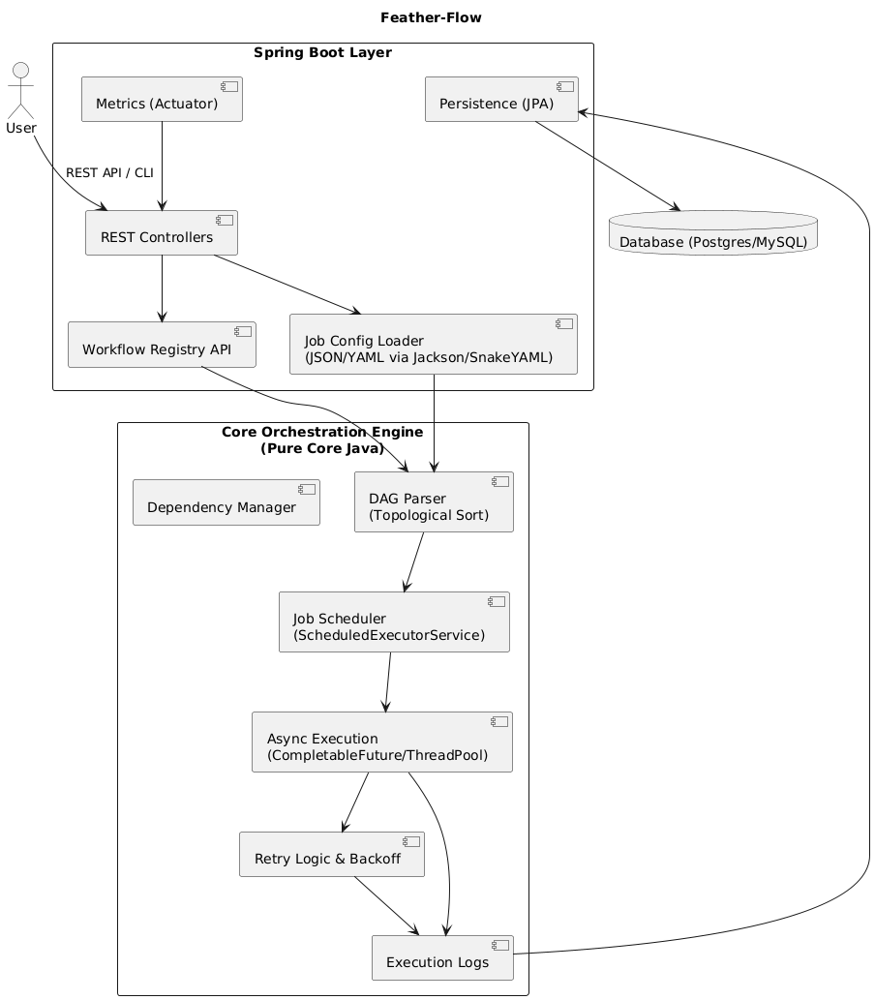
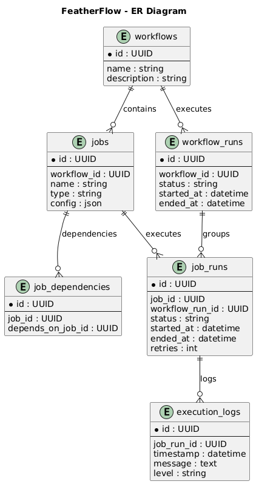
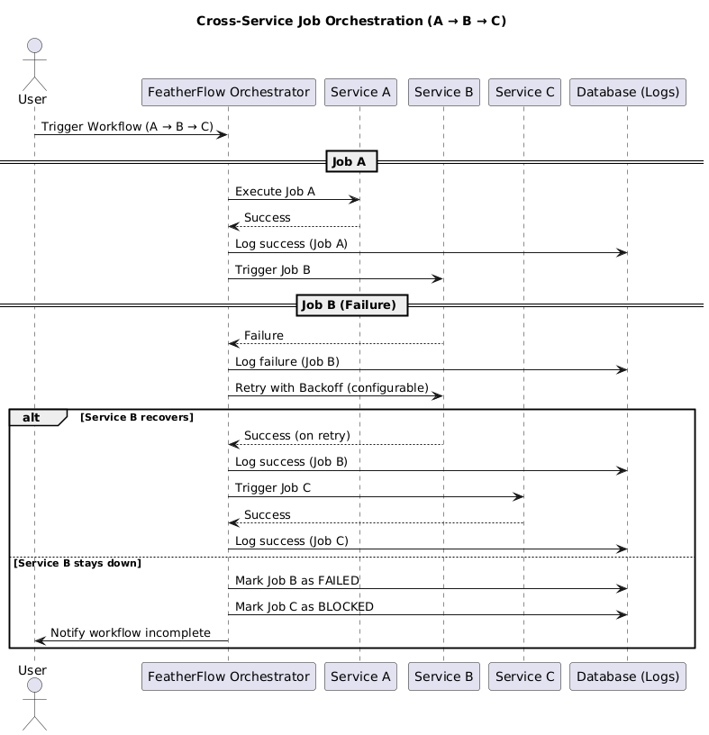

# feather-flow
A lightweight, config-driven job orchestrator for Java microservices
# HLD 

# ERD 

#Failure processing

# MVP Scope

1. MVP Scope (No Auth)
2. Input: YAML workflow definitions in src/main/resources/assets/.
Each workflow has jobs + dependencies.
3. Core Features: Parse YAML → Java POJOs.
4. Validate DAG → check for cycles, missing dependencies.
5. Persist workflow → insert workflow + jobs into DB.
6. Execute workflow: Run jobs in topological order.
7. Handle parallel execution (jobs without dependencies run concurrently).
8. Record job runs + workflow runs.
9. Logs: Write to DB + console. 

# Out of Scope for MVP:
1. Authentication/authorization.
2. UI/dashboard.
3. Distributed execution.
4. Complex retry/timeout strategies (just fail fast)